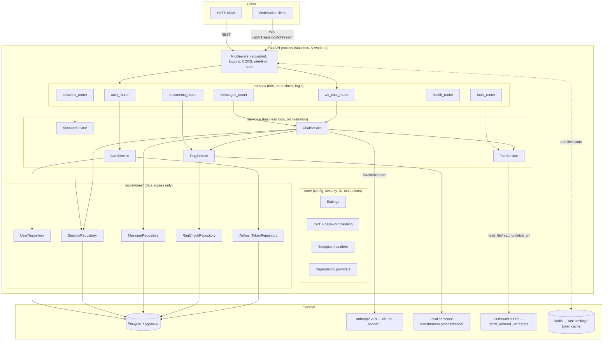

# ScoreWise — FastAPI Backend Specification

**Status:** Blueprint / not yet implemented
**Target:** Convert the existing CLI chatbot (`chatbot/`) into a stateless, multi-user FastAPI backend exposing every current capability over REST + WebSocket.
**Versioning:** All routes are prefixed `/api/v1`.

---

## 1. Source Analysis — what the current app actually does

Read directly from the repository (not assumed). Every row below maps to real code.

| Capability | Current implementation | File |
|---|---|---|
| User registration | `create_user(name, nickname, password, age)`, bcrypt hash, UUID id | `chatbot/db/users.py` |
| Login | `auth_user(nickname, password)` → bcrypt compare → `user_id` or `None` | `chatbot/db/users.py` |
| User profile | `get_user_profile(user_id)` → name/nickname/age, injected into system prompt | `chatbot/db/users.py`, `chatbot/main.py` |
| Session (chat) create | `create_session(user_id)` → UUID | `chatbot/db/sessions.py` |
| Session list | `list_sessions(user_id)` → `[(id, title)]` ordered by `last_active DESC` | `chatbot/db/sessions.py` |
| Session title (auto) | `set_session_title` — only fills if `NULL`, generated after first turn | `chatbot/db/sessions.py`, `chatbot/chat/title.py` |
| Session touch | `touch_session(session_id)` updates `last_active` after every turn | `chatbot/db/sessions.py` |
| Session delete (one/all) | `delete_session`, `delete_all_sessions` (cascades to messages via FK) | `chatbot/db/sessions.py` |
| Message persistence | `save_message(session_id, role, content)`, `load_history`, `load_last_exchange` | `chatbot/db/messages.py` |
| Chat orchestration | `run_chat()` — builds prompt, invokes LLM, loops on `tool_calls`, injects RAG context, saves both turns | `chatbot/chat/loop.py` |
| Prompt assembly | `build_prompt(user_context)` — system + context + history placeholder + human turn | `chatbot/chat/chain.py` |
| LLM client | `ChatAnthropic` (`claude-sonnet-5`, `max_tokens=8192`, `streaming=True`) | `chatbot/llm/client.py` |
| Tool: current time | `get_current_time()` | `chatbot/chat/tools.py` |
| Tool: read local file | `read_file(path, max_chars=8000)` — confined to project root, indexes result into RAG | `chatbot/chat/tools.py` |
| Tool: fetch URL (raw) | `fetch_url(url, max_chars=2000, timeout_s=8)` — no indexing | `chatbot/chat/tools.py` |
| Tool: read URL (cleaned) | `read_url(url, max_chars=8000, timeout_s=8)` — strips HTML, indexes result into RAG | `chatbot/chat/tools.py` |
| RAG indexing | `index_text(source, text, chunk_size=800, overlap=120)` — chunk + embed + store in memory | `chatbot/chat/rag.py` |
| RAG retrieval | `retrieve(query, k=4)` — cosine similarity over in-memory vectors | `chatbot/chat/rag.py` |
| Embeddings | Local `sentence-transformers` (`all-MiniLM-L6-v2`, 384-dim), no external API | `chatbot/chat/rag.py` |
| Schema bootstrap | `run_schema()` — `CREATE TABLE IF NOT EXISTS` on every process start | `chatbot/db/migrations.py`, `chatbot/db/schema.sql` |
| Config | `.env` via `python-dotenv`: `DATABASE_URL`, `ANTHROPIC_API_KEY`, `ANTHROPIC_MODEL`, `EMBEDDING_MODEL` | root `.env` |

**Important gaps that block a direct lift to a stateless API** (called out explicitly, addressed in §9 and §16):

1. **RAG store is in-process memory** (`_STORE: dict[str, list[Chunk]]` in `rag.py`) — dies on restart, and is invisible to any worker process other than the one that populated it. A multi-worker/horizontally-scaled API **cannot** use this as-is. §9 replaces it with a Postgres+pgvector table.
2. **No token-based auth** — the CLI trusts whichever process called `login_flow()`. The API needs real session/token auth (§5).
3. **No true token streaming to the caller** — `_print_in_chunks` fakes streaming by slicing the *already-complete* response string; `ChatAnthropic(streaming=True)` only affects the internal HTTP transport, not what the CLI shows. The WebSocket spec in §7 fixes this by using `astream()`/`astream_events()` against the real Anthropic stream.
4. **No rate limiting, structured logging, or audit trail** — added fresh in §8, §11, §12.

---

## 2. Architecture

Layered/clean architecture. Routers depend only on Services; Services depend only on Repository/LLM/RAG interfaces; Repositories are the only layer that touches Postgres/pgvector.



**Rule enforced across the codebase:** a router file may only (a) parse/validate the request via a Pydantic schema, (b) call exactly one service method, (c) map the result/exception to an HTTP response. No SQL, no LLM calls, no business rules in `routers/`.

---

## 3. Proposed directory structure

```
app/
├── main.py                     # FastAPI() app factory, router registration, middleware wiring
├── core/
│   ├── config.py                # Settings (pydantic-settings), loaded once from env
│   ├── security.py               # JWT encode/decode, bcrypt hashing (reuses bcrypt==4.2.1)
│   ├── exceptions.py              # AppError hierarchy + FastAPI exception handlers
│   ├── deps.py                    # get_current_user, get_db_session, get_settings, rate limiter dep
│   ├── logging.py                 # structured JSON logging setup, request-id contextvar
│   └── middleware.py              # RequestIDMiddleware, TimingMiddleware
├── schemas/
│   ├── auth.py                    # RegisterRequest, LoginRequest (OAuth2 form), TokenPair, UserPublic
│   ├── session.py                 # SessionCreate, SessionOut, SessionListItem
│   ├── message.py                 # MessageOut, SendMessageRequest, SendMessageResponse
│   ├── document.py                 # DocumentIngestRequest (url), DocumentOut
│   ├── tool.py                     # ToolDefinitionOut
│   └── common.py                   # ErrorResponse, Page[T], HealthOut
├── routers/
│   ├── auth.py                     # /api/v1/auth/*
│   ├── sessions.py                 # /api/v1/sessions/*
│   ├── messages.py                 # /api/v1/sessions/{id}/messages
│   ├── documents.py                # /api/v1/sessions/{id}/documents
│   ├── tools.py                    # /api/v1/tools
│   ├── health.py                   # /healthz, /readyz, /api/v1/version
│   └── ws_chat.py                  # /api/v1/sessions/{id}/stream (WebSocket)
├── services/
│   ├── auth_service.py
│   ├── session_service.py
│   ├── chat_service.py             # orchestration: prompt build → LLM → tool loop → RAG → persist
│   ├── rag_service.py              # chunk/embed/store/retrieve (pgvector-backed)
│   ├── tool_service.py             # tool registry + sandboxed execution + audit logging
│   └── title_service.py            # session title generation (mirrors chat/title.py)
├── repositories/
│   ├── user_repository.py
│   ├── session_repository.py
│   ├── message_repository.py
│   ├── rag_chunk_repository.py
│   ├── refresh_token_repository.py
│   └── tool_invocation_repository.py
├── llm/
│   └── anthropic_client.py         # thin wrapper factory around ChatAnthropic (async)
└── db/
    ├── base.py                      # async engine/session factory (SQLAlchemy 2.0 async or asyncpg pool)
    └── migrations/                  # Alembic migration scripts (replaces ad-hoc schema.sql)
tests/
├── unit/                            # one file per service, repositories/LLM mocked
├── integration/                     # one file per router, TestClient + test DB
└── conftest.py                      # fixtures: test settings, test DB (transaction rollback), fake LLM
```

---

## 4. API versioning strategy

- All application routes live under `/api/v1`. `/healthz` and `/readyz` are unversioned infra probes (convention: liveness/readiness endpoints are never versioned since orchestrators call them before the app is "ready").
- Breaking changes ship as `/api/v2` running alongside `/api/v1` until clients migrate; additive changes (new optional fields, new endpoints) do not bump the version.
- Version is also surfaced at `GET /api/v1/version` returning `{"api_version": "1.0.0", "git_sha": "..."}` for client/ops visibility.
- Deprecation policy: a deprecated endpoint returns a `Deprecation` and `Sunset` HTTP header (RFC 8594) for at least one release cycle before removal.

---

## 5. Authentication & Authorization

**Chosen approach: OAuth2 Password Grant + JWT access/refresh tokens.**

Rationale: the existing user model is already username(nickname)+password with bcrypt (`chatbot/db/users.py`) — this is exactly the OAuth2 "Resource Owner Password Credentials" shape FastAPI's `OAuth2PasswordBearer`/`OAuth2PasswordRequestForm` are built for. No external identity provider exists or is needed for a single-tenant personal chatbot, so full OAuth2/OIDC redirect flows would be over-engineering. API keys are rejected because the app has *individual human users* with passwords already, not machine clients.

- **Access token**: JWT, `HS256` (or `RS256` if multi-service verification is anticipated later), 30-minute expiry, claims: `sub` (user_id), `nickname`, `iat`, `exp`, `jti`.
- **Refresh token**: opaque random 256-bit token, stored **hashed** (SHA-256) in `refresh_tokens` table with `expires_at` and `revoked_at`; 14-day expiry; rotated on every use (old one revoked, new one issued) to detect replay.
- **Password hashing**: unchanged — `bcrypt==4.2.1`, same cost factor as today.
- **Authorization model**: every session/message/document resource is scoped to `user_id`. Every service method that touches a session must verify `session.user_id == current_user.id` before returning/mutating — return `404` (not `403`) on mismatch to avoid confirming resource existence to non-owners.
- **WebSocket auth**: browsers cannot set custom headers on the WS handshake reliably, so the access token is passed as a query parameter (`?token=...`) or the `Sec-WebSocket-Protocol` header (preferred — doesn't leak into server access logs/proxies the way query strings do). The server validates the JWT **before** calling `accept()`; on failure it closes with code `4401`.
- **CORS**: `CORSMiddleware` with an explicit allow-list from `CORS_ORIGINS` env var (comma-separated); `allow_credentials=True` only if the allow-list is non-wildcard; no `allow_origins=["*"]` in production.
- **Transport security**: TLS terminated at the load balancer/reverse proxy (not the app); `SecureHeadersMiddleware` sets `Strict-Transport-Security`, `X-Content-Type-Options: nosniff`, `X-Frame-Options: DENY`.

| Endpoint | Auth required |
|---|---|
| `POST /api/v1/auth/register` | No |
| `POST /api/v1/auth/login` | No (credentials in body) |
| `POST /api/v1/auth/refresh` | No (refresh token in body is the credential) |
| `POST /api/v1/auth/logout` | Yes (access token) |
| `GET /api/v1/auth/me` | Yes |
| All `/sessions`, `/messages`, `/documents`, `/tools` routes | Yes |
| `WS /api/v1/sessions/{id}/stream` | Yes (token via subprotocol) |
| `GET /healthz`, `GET /readyz`, `GET /api/v1/version` | No |

---

## 6. Endpoint Reference

### 6.1 Health & Meta

| Method | Path | Purpose | Auth | Success | Errors |
|---|---|---|---|---|---|
| GET | `/healthz` | Liveness — process is up | No | `200 {"status":"ok"}` | — |
| GET | `/readyz` | Readiness — DB reachable + LLM client constructible | No | `200 {"status":"ready","checks":{"db":"ok","llm":"ok"}}` | `503` if any check fails |
| GET | `/api/v1/version` | Build/version info | No | `200 VersionOut` | — |

### 6.2 Auth

| Method | Path | Purpose | Auth | Request | Success | Errors |
|---|---|---|---|---|---|---|
| POST | `/api/v1/auth/register` | Create a user account | No | `RegisterRequest` | `201 UserPublic` | `409` nickname taken, `422` validation |
| POST | `/api/v1/auth/login` | Exchange nickname+password for tokens | No | `application/x-www-form-urlencoded` (OAuth2 form: `username`, `password`) | `200 TokenPair` | `401` invalid credentials |
| POST | `/api/v1/auth/refresh` | Rotate refresh token → new access token | No | `RefreshRequest` | `200 TokenPair` | `401` invalid/expired/revoked refresh token |
| POST | `/api/v1/auth/logout` | Revoke current refresh token | Yes | `RefreshRequest` | `204` | `401` |
| GET | `/api/v1/auth/me` | Current user profile | Yes | — | `200 UserPublic` | `401` |

```python
# schemas/auth.py — illustrative field-level spec (not implementation)
class RegisterRequest(BaseModel):
    name: str = Field(min_length=1, max_length=100)
    nickname: str = Field(min_length=3, max_length=32, pattern=r"^[a-zA-Z0-9_]+$")
    password: str = Field(min_length=8, max_length=128)
    age: int = Field(ge=13, le=120)

class UserPublic(BaseModel):
    id: UUID
    name: str
    nickname: str
    age: int
    created_at: datetime

class TokenPair(BaseModel):
    access_token: str
    refresh_token: str
    token_type: Literal["bearer"] = "bearer"
    expires_in: int  # seconds, access token TTL

class RefreshRequest(BaseModel):
    refresh_token: str
```

### 6.3 Sessions

| Method | Path | Purpose | Auth | Request | Success | Errors |
|---|---|---|---|---|---|---|
| POST | `/api/v1/sessions` | Create a new chat session | Yes | — | `201 SessionOut` | `401` |
| GET | `/api/v1/sessions` | List caller's sessions, newest-active first | Yes | Query: `limit` (default 20, max 100), `offset` | `200 Page[SessionListItem]` | `401` |
| GET | `/api/v1/sessions/{session_id}` | Get one session | Yes | — | `200 SessionOut` | `401`, `404` (not owner or missing) |
| PATCH | `/api/v1/sessions/{session_id}` | Rename session title | Yes | `{"title": "..."}` | `200 SessionOut` | `401`, `404`, `422` |
| DELETE | `/api/v1/sessions/{session_id}` | Delete one session (cascades messages + RAG chunks) | Yes | — | `204` | `401`, `404` |
| DELETE | `/api/v1/sessions` | Delete **all** of caller's sessions | Yes | — | `204` | `401` |

```python
class SessionOut(BaseModel):
    id: UUID
    title: Optional[str]
    created_at: datetime
    last_active: datetime

class SessionListItem(BaseModel):
    id: UUID
    title: Optional[str]
    last_active: datetime
```

### 6.4 Messages (chat)

| Method | Path | Purpose | Auth | Request | Success | Errors |
|---|---|---|---|---|---|---|
| GET | `/api/v1/sessions/{session_id}/messages` | Full history, oldest → newest | Yes | Query: `limit`, `offset` | `200 Page[MessageOut]` | `401`, `404` |
| POST | `/api/v1/sessions/{session_id}/messages` | Send a message; server runs the full LLM+tool+RAG turn synchronously and returns the assistant reply | Yes | `SendMessageRequest` | `201 SendMessageResponse` | `401`, `404`, `422`, `429` (rate limited), `502` (LLM upstream failure), `504` (LLM timeout) |
| WS | `/api/v1/sessions/{session_id}/stream` | Same as above, but streamed token-by-token + tool events | Yes (subprotocol token) | See §7 | — | connection closed with a WS close code (see §7) |

```python
class SendMessageRequest(BaseModel):
    content: str = Field(min_length=1, max_length=8000)

class MessageOut(BaseModel):
    id: UUID
    role: Literal["user", "assistant"]
    content: str
    created_at: datetime

class SendMessageResponse(BaseModel):
    user_message: MessageOut
    assistant_message: MessageOut
    tool_calls: list[ToolCallSummary] = []   # what the model invoked this turn, for transparency
    generated_title: Optional[str] = None     # populated only on the session's first turn

class ToolCallSummary(BaseModel):
    name: str
    args: dict
    status: Literal["ok", "error"]
    duration_ms: int
```

**Business rule ported from `chat/loop.py`:** `generated_title` is populated only when this was the first message in the session (`len(history) == 0` before this call), mirroring today's `is_first_turn` logic, and the service persists it via the same "only set if `title IS NULL`" semantics as `set_session_title`.

### 6.5 Documents (RAG ingestion) — new, first-class equivalent of today's implicit `read_file`/`read_url` tool calls

Today, indexing only happens as a *side effect* of the model autonomously choosing to call `read_file`/`read_url` mid-conversation. The API additionally exposes ingestion directly, so a client can pre-load context without depending on the model deciding to fetch it.

| Method | Path | Purpose | Auth | Request | Success | Errors |
|---|---|---|---|---|---|---|
| POST | `/api/v1/sessions/{session_id}/documents` | Ingest a URL or uploaded file into this session's RAG store | Yes | multipart file **or** `{"url": "https://..."}` | `201 DocumentOut` | `401`, `404`, `413` (too large), `422`, `502` (fetch failed) |
| GET | `/api/v1/sessions/{session_id}/documents` | List indexed sources for this session | Yes | — | `200 Page[DocumentOut]` | `401`, `404` |
| DELETE | `/api/v1/sessions/{session_id}/documents/{document_id}` | Remove an indexed source and its chunks | Yes | — | `204` | `401`, `404` |

```python
class DocumentOut(BaseModel):
    id: UUID
    source: str          # file path or URL
    chunk_count: int
    indexed_at: datetime
```

**Security constraints carried over and hardened from `chat/tools.py`:**
- File uploads are never resolved against a server filesystem path from client input (unlike the CLI's `read_file`, which does path confinement against `Path(__file__).resolve().parents[2]`) — the API only accepts uploaded **bytes**, eliminating the path-traversal attack surface entirely for this endpoint.
- URL ingestion enforces: `http(s)` scheme only, a configurable max content length (`MAX_INGEST_BYTES`), a request timeout, and **SSRF protection** — resolve the hostname and reject private/loopback/link-local IP ranges (`10.0.0.0/8`, `172.16.0.0/12`, `192.168.0.0/16`, `127.0.0.0/8`, `169.254.0.0/16`, and IPv6 equivalents) before connecting, since this endpoint lets any authenticated user make the server issue outbound requests.

### 6.6 Tools (introspection only — not direct invocation)

| Method | Path | Purpose | Auth | Success | Errors |
|---|---|---|---|---|---|
| GET | `/api/v1/tools` | List tool definitions available to the model (name, description, JSON schema) | Yes | `200 list[ToolDefinitionOut]` | `401` |

Tools are **not** directly invocable through a generic `/tools/{name}/invoke` endpoint. Rationale: `read_file`/`fetch_url`/`read_url` are safe only because the *model* decides when calling them serves the conversation, inside the constraints in `chat/tools.py`; a raw invoke endpoint would let any authenticated client use the server as an open URL-fetching/file-reading proxy. This is intentionally an explicit design decision (see §16 "Explicit non-goals").

```python
class ToolDefinitionOut(BaseModel):
    name: str
    description: str
    parameters: dict  # JSON Schema, mirrors the @tool-decorated function signature
```

---

## 7. WebSocket streaming protocol

**Endpoint:** `WS /api/v1/sessions/{session_id}/stream`
**Subprotocol carrying the access token:** client requests `Sec-WebSocket-Protocol: bearer.<access_token>`; server echoes `bearer` back on accept, or closes the handshake before `accept()` with code `4401` if the token is missing/invalid/expired, and `4403` if the session isn't owned by that user.

### Message framing (JSON text frames both directions)

**Client → server** (one frame per user turn):
```json
{ "type": "message", "content": "How do I draft a statement of purpose?" }
```

**Server → client**, in this order for a single turn:

| `type` | When | Payload |
|---|---|---|
| `ack` | Immediately on receipt | `{"type":"ack","user_message_id":"..."}` |
| `tool_call` | The model invokes a tool (0+ times per turn) | `{"type":"tool_call","name":"read_url","args":{...},"call_id":"..."}` |
| `tool_result` | That tool call finishes | `{"type":"tool_result","call_id":"...","status":"ok","summary":"Indexed 4 chunks from ..."}` |
| `token` | Each streamed text delta from the model (via `astream`/`astream_events`, i.e. *real* incremental generation, not the CLI's post-hoc chunk-slicing) | `{"type":"token","content":"Here"}` |
| `done` | Turn complete | `{"type":"done","assistant_message_id":"...","generated_title":"..."|null}` |
| `error` | Any failure mid-turn | `{"type":"error","code":"llm_upstream_error","message":"..."}` |

Close codes: `1000` normal client disconnect, `4401` auth failure, `4403` not session owner, `4404` session not found, `4409` another turn already in flight for this connection (server serializes turns per connection — no client-side race between two concurrent sends), `1011` unhandled server error.

**Reliability note:** if the connection drops mid-turn, the turn still completes server-side and is persisted (the WebSocket is a view onto the turn, not a requirement for it to finish) — a reconnecting client fetches the now-complete turn via `GET /api/v1/sessions/{id}/messages`. This mirrors the CLI's behavior where `save_message` runs after the full response is obtained regardless of what the terminal displayed.

---

## 8. Rate limiting & quota strategy

Two tiers, both backed by Redis (`REDIS_URL`) so limits are consistent across all worker processes/instances — an in-memory limiter would be per-process and trivially bypassed by hitting different workers.

| Scope | Endpoint group | Limit | Rationale |
|---|---|---|---|
| Per-user | `POST /sessions/{id}/messages`, WS `message` frames | 20 requests / minute, burst 5 | Each call is a paid LLM request; this is the expensive path |
| Per-user | `POST /sessions/{id}/documents` | 10 requests / minute | Triggers outbound network fetch + embedding compute |
| Per-user | All other authenticated routes | 120 requests / minute | Generic abuse guard |
| Per-IP | `POST /api/v1/auth/login`, `POST /api/v1/auth/register` | 5 requests / minute | Brute-force / enumeration protection, applied before auth succeeds so it must key on IP, not user |

- Implementation: `slowapi` (Redis-backed) or a hand-rolled sliding-window counter (`INCR` + `EXPIRE` in Redis) as a FastAPI dependency (`Depends(rate_limit("chat", limit=20, window=60))`), so it's testable/mockable like any other dependency.
- Exceeding a limit returns `429` with body `{"error":{"code":"rate_limited","message":"..."}}` and a `Retry-After` header (seconds).
- **Token/cost quota (optional, Phase 2):** track cumulative `usage.input_tokens + usage.output_tokens` per user per day in a `usage_daily` table; if a configurable `DAILY_TOKEN_BUDGET` is set and exceeded, `POST /messages` returns `429` with `code: "quota_exceeded"` before calling the LLM at all.

---

## 9. Data models / DB schema

Extends `chatbot/db/schema.sql`. Managed via **Alembic** migrations going forward (the current `run_schema()` "CREATE TABLE IF NOT EXISTS on every boot" approach doesn't support column changes/rollback and is replaced, not kept, for the API service — see §16).

```sql
-- Unchanged from the current app
CREATE EXTENSION IF NOT EXISTS "uuid-ossp";
CREATE EXTENSION IF NOT EXISTS "vector";  -- pgvector, new requirement

CREATE TABLE users (
    id UUID PRIMARY KEY DEFAULT uuid_generate_v4(),
    name TEXT NOT NULL,
    nickname TEXT UNIQUE NOT NULL,
    password_hash TEXT NOT NULL,
    age INT NOT NULL,
    created_at TIMESTAMPTZ NOT NULL DEFAULT now()
);

CREATE TABLE chat_sessions (
    id UUID PRIMARY KEY DEFAULT uuid_generate_v4(),
    user_id UUID NOT NULL REFERENCES users(id) ON DELETE CASCADE,
    title TEXT,
    created_at TIMESTAMPTZ NOT NULL DEFAULT now(),
    last_active TIMESTAMPTZ NOT NULL DEFAULT now()
);
CREATE INDEX idx_chat_sessions_user_last_active ON chat_sessions(user_id, last_active DESC);

CREATE TABLE messages (
    id UUID PRIMARY KEY DEFAULT uuid_generate_v4(),
    session_id UUID NOT NULL REFERENCES chat_sessions(id) ON DELETE CASCADE,
    role TEXT NOT NULL CHECK (role IN ('user', 'assistant')),
    content TEXT NOT NULL,
    created_at TIMESTAMPTZ NOT NULL DEFAULT now()
);
CREATE INDEX idx_messages_session_created ON messages(session_id, created_at ASC);

-- NEW: persistent, multi-worker-safe replacement for chat/rag.py's in-memory _STORE
CREATE TABLE rag_documents (
    id UUID PRIMARY KEY DEFAULT uuid_generate_v4(),
    session_id UUID NOT NULL REFERENCES chat_sessions(id) ON DELETE CASCADE,
    source TEXT NOT NULL,               -- file path or URL, matches tools.py's `source`
    indexed_at TIMESTAMPTZ NOT NULL DEFAULT now()
);

CREATE TABLE rag_chunks (
    id UUID PRIMARY KEY DEFAULT uuid_generate_v4(),
    document_id UUID NOT NULL REFERENCES rag_documents(id) ON DELETE CASCADE,
    session_id UUID NOT NULL REFERENCES chat_sessions(id) ON DELETE CASCADE,  -- denormalized for fast per-session vector search
    chunk_index INT NOT NULL,
    content TEXT NOT NULL,
    embedding VECTOR(384) NOT NULL,     -- all-MiniLM-L6-v2 output dimension
    created_at TIMESTAMPTZ NOT NULL DEFAULT now()
);
CREATE INDEX idx_rag_chunks_session_embedding ON rag_chunks
    USING ivfflat (embedding vector_cosine_ops) WITH (lists = 100);
-- Retrieval query becomes:
--   SELECT content FROM rag_chunks WHERE session_id = :sid
--   ORDER BY embedding <=> :query_embedding LIMIT :k;
-- (replaces the O(n) Python cosine loop in rag.py's retrieve())

-- NEW: JWT refresh token store, enables revocation/rotation (§5)
CREATE TABLE refresh_tokens (
    id UUID PRIMARY KEY DEFAULT uuid_generate_v4(),
    user_id UUID NOT NULL REFERENCES users(id) ON DELETE CASCADE,
    token_hash TEXT NOT NULL UNIQUE,     -- SHA-256 of the opaque token, never store raw
    expires_at TIMESTAMPTZ NOT NULL,
    revoked_at TIMESTAMPTZ,
    created_at TIMESTAMPTZ NOT NULL DEFAULT now()
);
CREATE INDEX idx_refresh_tokens_user ON refresh_tokens(user_id) WHERE revoked_at IS NULL;

-- NEW: audit trail for every tool the model invokes (observability + security review)
CREATE TABLE tool_invocations (
    id UUID PRIMARY KEY DEFAULT uuid_generate_v4(),
    session_id UUID NOT NULL REFERENCES chat_sessions(id) ON DELETE CASCADE,
    tool_name TEXT NOT NULL,
    args JSONB NOT NULL,
    status TEXT NOT NULL CHECK (status IN ('ok', 'error')),
    duration_ms INT NOT NULL,
    error_message TEXT,
    created_at TIMESTAMPTZ NOT NULL DEFAULT now()
);
CREATE INDEX idx_tool_invocations_session ON tool_invocations(session_id, created_at DESC);

-- OPTIONAL (Phase 2): per-user daily token usage for quota enforcement (§8)
CREATE TABLE usage_daily (
    user_id UUID NOT NULL REFERENCES users(id) ON DELETE CASCADE,
    usage_date DATE NOT NULL,
    input_tokens BIGINT NOT NULL DEFAULT 0,
    output_tokens BIGINT NOT NULL DEFAULT 0,
    PRIMARY KEY (user_id, usage_date)
);
```

---

## 10. Configuration / environment variables

| Variable | Required | Default | Purpose |
|---|---|---|---|
| `DATABASE_URL` | Yes | — | Postgres connection string (async driver, e.g. `postgresql+asyncpg://...`) |
| `ANTHROPIC_API_KEY` | Yes | — | Anthropic API credential |
| `ANTHROPIC_MODEL` | No | `claude-sonnet-5` | Chat model |
| `EMBEDDING_MODEL` | No | `all-MiniLM-L6-v2` | Local sentence-transformers model name |
| `JWT_SECRET_KEY` | Yes | — | HMAC signing secret for access tokens; **never hardcoded**, injected via env/secrets manager |
| `JWT_ALGORITHM` | No | `HS256` | Signing algorithm |
| `ACCESS_TOKEN_EXPIRE_MINUTES` | No | `30` | Access token TTL |
| `REFRESH_TOKEN_EXPIRE_DAYS` | No | `14` | Refresh token TTL |
| `CORS_ORIGINS` | Yes (prod) | `` | Comma-separated allow-list, no wildcard in prod |
| `REDIS_URL` | Yes | — | Rate limiting + refresh-token/session cache backend |
| `MAX_INGEST_BYTES` | No | `2000000` | Cap on `/documents` upload/fetch size |
| `DAILY_TOKEN_BUDGET` | No | unset (disabled) | Optional per-user daily token quota (§8) |
| `LOG_LEVEL` | No | `INFO` | Logging verbosity |
| `APP_ENV` | No | `development` | `development` \| `staging` \| `production` — gates debug features (e.g. `/docs` exposure) |
| `WORKERS` | No | `4` | Gunicorn/Uvicorn worker count (deployment only, not read by the app itself) |

`core/config.py` loads all of these via `pydantic-settings.BaseSettings`, so a missing required variable fails fast at process startup with a clear validation error — not on the first request that happens to need it.

---

## 11. Error handling conventions

**Every error response, regardless of source, has this envelope:**

```json
{
  "error": {
    "code": "session_not_found",
    "message": "Session 3fa8...b21 was not found.",
    "details": {},
    "request_id": "9f1c2e40-..."
  }
}
```

- `code`: stable, machine-readable, `snake_case` — clients branch on this, never on `message`.
- `message`: human-readable, safe to display; never includes stack traces, SQL, or internal paths.
- `details`: optional structured extra context (e.g. field-level validation errors).
- `request_id`: echoes the `X-Request-ID` set by the request-id middleware (§12), for cross-referencing logs.

**`core/exceptions.py` defines an `AppError` hierarchy**, one subclass per failure mode (`NotFoundError`, `ConflictError`, `UnauthorizedError`, `ForbiddenError`, `ValidationError`, `RateLimitedError`, `UpstreamError`), each carrying its own HTTP status + `code`. Services raise these; they never raise raw `HTTPException` (keeps services testable/framework-agnostic) or let unrelated exceptions (`psycopg.Error`, `anthropic.APIError`, `requests.RequestException`) escape to the client. A single FastAPI exception handler:

```python
# Illustrative mapping table — not the implementation itself
AppError                 -> its own .status_code, .code
RequestValidationError   -> 422, code="validation_error", details=pydantic error list
anthropic.RateLimitError -> 502, code="llm_rate_limited"     # upstream, not ours — see below
anthropic.APIStatusError -> 502, code="llm_upstream_error"
anthropic.APITimeoutError-> 504, code="llm_timeout"
Exception (catch-all)    -> 500, code="internal_error", message="An unexpected error occurred."
                            (full exception logged server-side with request_id; never in the response)
```

**No unhandled exception ever reaches the client as a bare 500 with a traceback** — the catch-all handler guarantees the envelope shape even for bugs, satisfying the reliability requirement.

**Retries:** the LLM client wrapper (`llm/anthropic_client.py`) uses the Anthropic SDK's built-in retry (`max_retries`, default 2, exponential backoff on 429/5xx) — no custom retry loop needed. Tool execution (`fetch_url`/`read_url`) does **not** auto-retry (a slow/unreachable third-party site should fail fast back to the model, which can decide whether to try something else).

---

## 12. Logging & observability

- **Structured logging**: JSON lines via `structlog` (or stdlib `logging` + a JSON formatter), one event per line: `{"timestamp","level","event","request_id","user_id","session_id","path","method","status_code","duration_ms",...}`. Never log passwords, tokens, or full message content at `INFO`; message content only at `DEBUG` and only in non-production environments.
- **Request ID**: `RequestIDMiddleware` generates (or propagates an inbound `X-Request-ID`) a UUID per request, stores it in a `contextvar`, attaches it to every log line emitted during that request, and returns it in the `X-Request-ID` response header and in every error envelope (§11).
- **LLM call tracing**: every `ChatService` turn logs a structured event with `model`, `input_tokens`, `output_tokens`, `stop_reason`, `latency_ms`, and the list of tool names invoked — this is the operational equivalent of watching the CLI's stdout, but queryable.
- **Health checks**: `/healthz` (process up) vs `/readyz` (dependencies reachable) are kept separate on purpose — a load balancer should stop routing to a pod that's up but DB-less (`readyz` fails) without killing/restarting it (which `healthz` failing would trigger).
- **Metrics (Phase 2)**: `GET /metrics` in Prometheus text format via `prometheus-fastapi-instrumentator` — request count/latency histograms by route+status, plus custom counters for tool invocations and LLM token usage.
- **Tracing (Phase 2)**: OpenTelemetry auto-instrumentation for FastAPI + the Postgres driver + outbound HTTP, exported via OTLP, so a single chat turn's spans (route → service → LLM call → tool call → DB write) are visible as one trace.

---

## 13. Testing strategy

| Layer | Tool | Approach |
|---|---|---|
| Services (unit) | `pytest` + `pytest-asyncio` | One test module per service. Repositories and the LLM client are injected via constructor/DI and replaced with fakes/mocks (`unittest.mock` or hand-written in-memory fakes) — e.g. `ChatService` tests never touch Postgres or the real Anthropic API; a `FakeAnthropicClient` returns canned `AIMessage`s including a tool-call scenario, to test the tool loop and the "system message can't appear mid-conversation" constraint in isolation. |
| Repositories (integration) | `pytest` + a real Postgres test database (Docker, `pgvector/pgvector` image) | Each test runs inside a transaction that's rolled back at teardown (or `TRUNCATE` between tests) so tests are independent and fast. |
| Routers (integration) | `httpx.AsyncClient` against the FastAPI app with `app.dependency_overrides` swapping in test DB/fake LLM | Exercises the full request→response cycle including auth, validation, and the error-envelope shape, per endpoint in §6. |
| WebSocket | `starlette.testclient.TestClient.websocket_connect` | Asserts the exact frame sequence in §7 (`ack` → `tool_call`* → `tool_result`* → `token`* → `done`), and the close codes for auth/ownership failures. |
| Contract | Generated OpenAPI schema diffed in CI against a committed snapshot | Fails CI on accidental breaking schema changes to a versioned route. |
| Load/perf (Phase 2) | `locust` or `k6` against a staging deployment | Validates the rate limiter under concurrent load and measures p95 latency for `/messages` (LLM-bound) vs pure-DB routes. |

**Dependency injection is what makes all of the above possible without hitting Anthropic or Postgres in unit tests** — every service takes its collaborators (repositories, LLM client, RAG service) as constructor arguments resolved via FastAPI's `Depends()` graph in `core/deps.py`, never imports/instantiates them directly. This directly satisfies the "Testability" quality attribute.

---

## 14. Deployment

- **Process model**: `gunicorn -k uvicorn.workers.UvicornWorker -w $WORKERS app.main:app` behind a reverse proxy (nginx/Caddy/ALB) that terminates TLS and forwards `X-Forwarded-For`/`X-Forwarded-Proto`. Worker count follows the standard `2 * CPU_CORES + 1` heuristic, tuned down if the box is memory-constrained (the local embedding model keeps a `sentence-transformers`/torch model resident per worker process — see the note below).
- **Statelessness**: because the RAG store moves to Postgres+pgvector (§9) and auth moves to JWT (§5), **any worker can serve any request** — no sticky sessions needed, horizontal scaling is a matter of adding more container replicas behind the load balancer.
- **Containerization**: multi-stage `Dockerfile` — build stage installs dependencies (`uv sync --frozen`), runtime stage copies only the venv + app code onto a slim Python base image; run as a non-root user.
- **docker-compose (local/dev)**: `api` (this service), `postgres` (`pgvector/pgvector:pg16` image — pgvector must be available, unlike the current plain `postgres:16` container used by the CLI app), `redis` (rate limiting).
- **Migrations**: `alembic upgrade head` runs as a release step (CI/CD job or init container) **before** new app replicas start serving traffic — replacing the current app's own "run schema on every boot" behavior, which is unsafe for concurrent multi-replica startups (races on `CREATE TABLE`/`ALTER`) and has no rollback path.
- **Secrets**: `JWT_SECRET_KEY`, `ANTHROPIC_API_KEY`, `DATABASE_URL` sourced from the platform's secrets manager (e.g. AWS Secrets Manager, Doppler, Kubernetes `Secret`) and injected as environment variables at container start — never committed, never baked into the image.
- **Resource note**: the local embedding model (`sentence-transformers`, backed by `torch`) is loaded once per worker process and kept warm (module-level singleton, mirroring `rag.py`'s current `_EMBEDDER` global but scoped per-process) — avoid re-instantiating it per request. Memory-budget each worker for the model's footprint (~200–400MB for `all-MiniLM-L6-v2` + torch) when sizing `WORKERS` and the container's memory limit.
- **Zero-downtime deploys**: rolling replica replacement behind the load balancer's health check hitting `/readyz`.

---

## 15. Quality attributes — traceability matrix

| Attribute | How this spec addresses it |
|---|---|
| **Reliability** | `AppError` hierarchy + single catch-all exception handler (§11) guarantee no unhandled exception reaches a client as a raw 500/traceback. Anthropic SDK's built-in retry/backoff on 429/5xx (§11). `/readyz` keeps unhealthy replicas out of rotation before they fail requests. |
| **Security** | JWT auth on every non-public route with per-resource ownership checks (§5); bcrypt password hashing unchanged; input validation via Pydantic on every request body; secrets only via env/secrets manager, never hardcoded (§10); SSRF protections + upload-only file handling on `/documents` (§6.5); CORS allow-list, no wildcard in prod (§5); tool invocation kept LLM-mediated only, not directly exposed (§6.6). |
| **Scalability** | Routers/services hold no in-process state; RAG store moves from in-memory dict to Postgres+pgvector so every worker/replica sees the same data (§9); async I/O end-to-end (async DB driver, async HTTP client for tool fetches, `astream` for the LLM) so a slow LLM/network call doesn't block a worker thread; Redis-backed rate limiting works correctly across multiple instances (§8). |
| **Maintainability** | Strict layering — routers thin, business logic only in services, DB access only in repositories (§2, §3); every request/response shape is a typed Pydantic schema (§6); one exception hierarchy, one error envelope, no ad-hoc error shapes per route (§11). |
| **Performance** | Async endpoints throughout; WebSocket streaming delivers tokens as the model generates them instead of waiting for the full response (§7); pgvector `ivfflat` index turns RAG retrieval from the current O(n) Python cosine-similarity loop into an indexed nearest-neighbor query (§9); connection pooling on the async DB engine. |
| **Testability** | Every service depends on injected collaborators via `core/deps.py`, resolved through FastAPI's `Depends()` — repositories and the LLM client are swappable with fakes in unit tests with zero network/DB access (§13). |
| **Observability** | Structured JSON logs correlated by request ID (§12); `/healthz` vs `/readyz` split; per-turn LLM usage/latency logging; audit table for every tool invocation (§9, §12); optional Prometheus metrics + OpenTelemetry tracing (§12, Phase 2). |
| **Documentation** | FastAPI auto-generates OpenAPI/Swagger UI (`/docs`) and ReDoc (`/redoc`) from the typed schemas and route decorators for free; every route function requires a docstring (purpose + auth requirement) enforced by a lint rule; this document (`api.md`) is the design-level companion to the generated reference. |
| **Extensibility** | New capability = new schema + new service method + new thin router — existing routers/services are never modified to add unrelated features (open/closed in practice); the tool registry (`ToolService`) is a plain list, so adding a new `@tool` only touches `tool_service.py` and `chat/tools.py`-equivalent, nothing in the routing/auth/persistence layers. |

---

## 16. Migration notes — from the current CLI app to this API

Explicit list of behavior that **changes** (not just "gets wrapped") going from `chatbot/main.py`'s interactive loop to this API, so nothing is silently lost or silently assumed compatible:

1. **Interactive `input()`/`getpass()` prompts are removed entirely** — `auth/flow.py`'s `register_flow`/`login_flow` become `AuthService.register`/`AuthService.login`, called from HTTP handlers instead of blocking on stdin.
2. **`readline` history suppression (`_init_readline` in `main.py`) is irrelevant** — that was a terminal-only concern.
3. **The RAG store changes from in-memory to persistent** (§9) — this is a behavior change, not just a storage change: today, restarting the CLI process silently wipes all indexed context for every session; the API preserves it across restarts/redeploys. Document this to users of the current CLI if data continuity is expected once they move to the API.
4. **"Streaming" changes meaning** — the CLI's `_print_in_chunks` was cosmetic (slices a complete string). The API's WebSocket path (§7) is genuinely incremental, backed by `astream_events()`. HTTP `POST /messages` remains fully synchronous/blocking (no fake chunking needed since there's no terminal to animate).
5. **`Ctrl+C`-to-return-to-menu semantics don't translate** — there is no "menu" in an API; the equivalent client-side action is simply not sending another request, or closing the WebSocket.
6. **Explicit non-goal:** direct tool invocation by API clients (§6.6) is a deliberate scope reduction from "the CLI's model can call these tools" to "the model can still call these tools, but a client can't call them directly through the API" — this is a security decision, not an oversight, and should be called out to anyone expecting full parity.
7. **Schema management changes from idempotent `CREATE TABLE IF NOT EXISTS` on every boot to Alembic migrations** (§14) — required for the `rag_chunks`/`refresh_tokens`/`tool_invocations`/pgvector additions to be introduced safely across environments, and for any future column change to be reversible.

---

## 17. Open questions for implementation follow-up

- **Multi-tenancy of the embedding model process**: should `sentence-transformers` run in-process per worker (simplest, current behavior ported as-is) or as a separate microservice behind a queue (better for GPU sharing/cost at higher scale)? This spec assumes in-process for parity with the current app; revisit if embedding load becomes a bottleneck.
- **Refresh token storage**: Redis (fast, TTL-native, but ephemeral) vs the `refresh_tokens` Postgres table specified in §9 (durable, survives Redis restarts). This spec chose Postgres for durability; Redis can be layered in front as a cache if refresh-token lookups become hot.
- **Streaming for `/documents` ingestion of very large files**: current `MAX_INGEST_BYTES` is a hard cap; chunked/streamed ingestion for larger documents is out of scope for v1.
